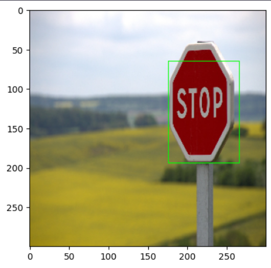
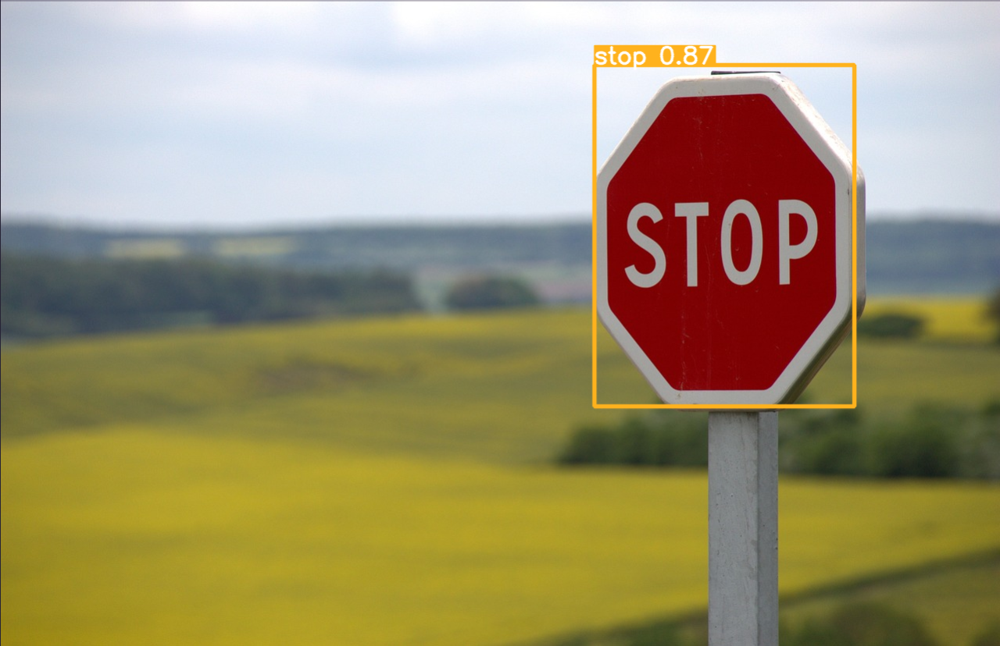

# Road Sign Detection Project

## Overview

This project aims to develop a robust and accurate road sign detection system using PyTorch, Tensorflow and Yolov5. The system is designed to identify and locate various types of road signs in images and video streams, contributing to enhanced road safety and autonomous driving capabilities.

## Features

- **Road Sign Detection:** Utilize state-of-the-art algorithms to detect and classify different road signs.
- **Real-time Processing:** Achieve real-time performance for road sign detection in live video streams.
- **Customization:** Easily extend the system to recognize additional road sign categories or adapt to specific use cases.

## Installation

1. Clone this repository:

   ```bash
   git clone https://github.com/VMD121199/road-sign-detection.git
   cd road-sign-detection
   ```

2. Install dependencies:

   ```bash
   pip install -r requirements.txt
   ```

<!-- 3. [Add any specific installation instructions or additional dependencies if needed.] -->

## Usage

[Provide clear instructions on how to use your road sign detection system. Include sample code snippets, command-line instructions, or usage examples.]

## Model Training

Our road sign detection model was trained using a diverse dataset of road sign images collected from various sources. The dataset comprises X categories of road signs, totaling Y images. We utilized the [insert name of the model architecture or algorithm] implemented in [insert framework/library, e.g., TensorFlow] for training.

### Training Process

1. **Data Preprocessing:** Images were resized to a standard input size of [specify dimensions], and data augmentation techniques such as rotation, flipping, and brightness adjustment were applied to enhance model generalization.

2. **Model Configuration:** We configured the [insert model architecture] with [insert hyperparameters] for optimal performance.

3. **Training:** The model was trained for Z epochs using the Adam optimizer, and the learning rate was dynamically adjusted using [insert learning rate scheduler method] to ensure convergence.

4. **Evaluation:** The trained model was evaluated on a separate validation dataset, achieving an accuracy of A%.

5. **Fine-tuning (Optional):** Fine-tuning on specific road sign categories or regions of interest was performed to improve model accuracy in critical areas.

### Pre-trained Models

For your convenience, we provide a pre-trained model [link to pre-trained model file]. You can use this model for road sign detection without the need for retraining, or as a starting point for further customization.

## Results

Our road sign detection system demonstrates robust performance across various scenarios. Below are some visual examples showcasing the system's capabilities:

**SSD16:**



**YOLO v5:**



### Performance Metrics

1. **SSD:**

- **Label accuracy:** 79.15%
- **Bounding box accuracy:** 71.5%

2. **YOLOv5:**

- **Precision:** 92.8%
- **Recall:** 81.7%
- **mAP50:** 88.7%
- **mAP50-95:** 60.8%

## Contributing

We welcome contributions from the community to enhance and improve this road sign detection project. If you would like to contribute, please follow these guidelines:

1. Fork the repository.
2. Create a new branch for your feature or bug fix.
3. Make your changes and submit a pull request.

Please ensure that your code adheres to our coding standards and includes relevant tests.

<!-- ## Acknowledgments

We would like to express our gratitude to the following:

- [Name of external library or framework] for providing essential functionality.
- [Name of dataset provider] for the road sign dataset used in training. -->
